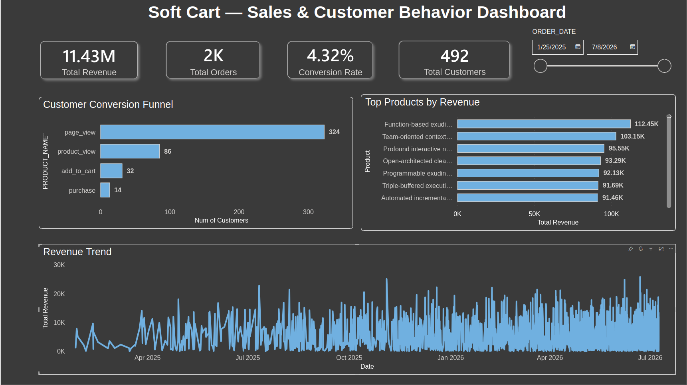
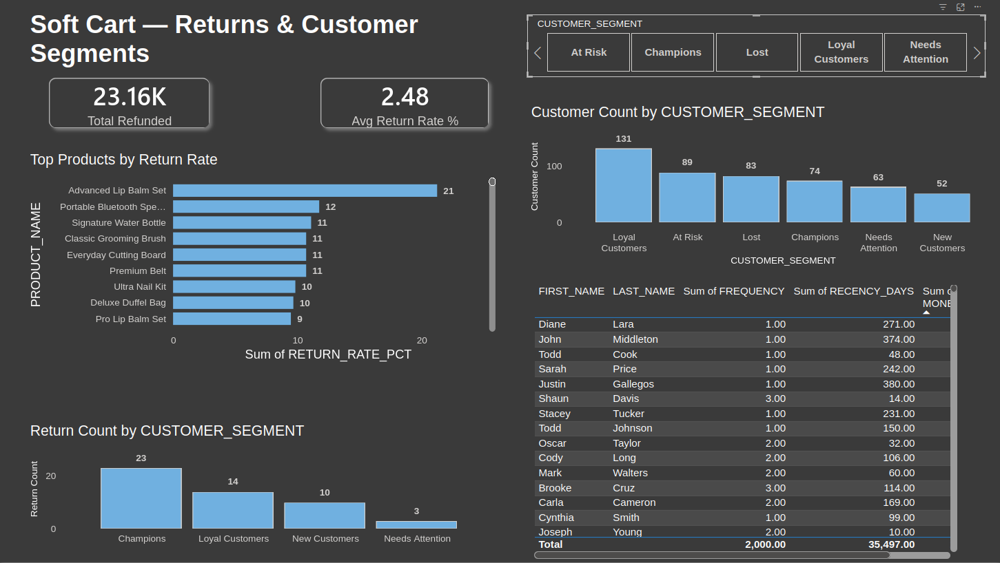
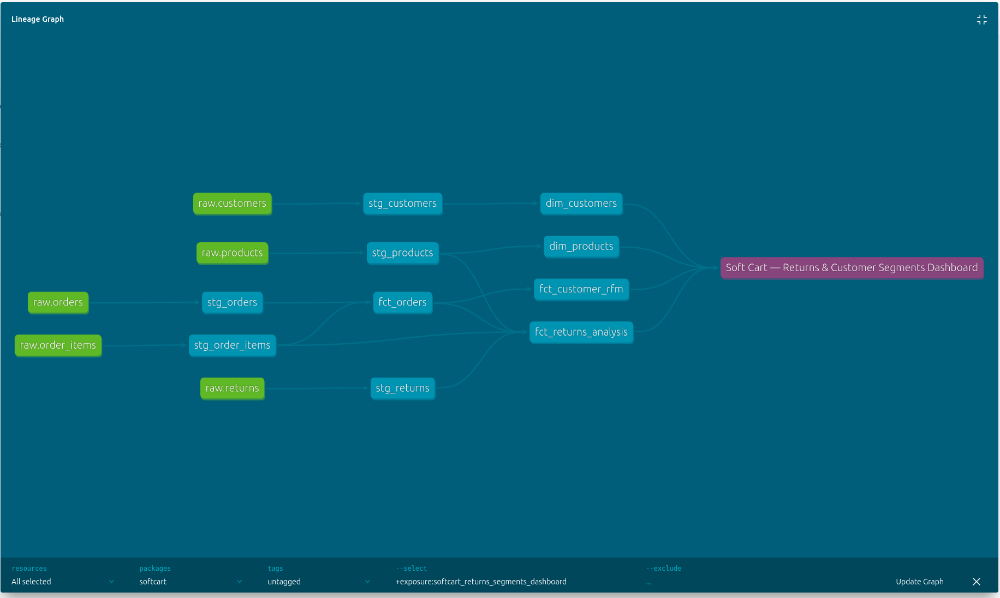
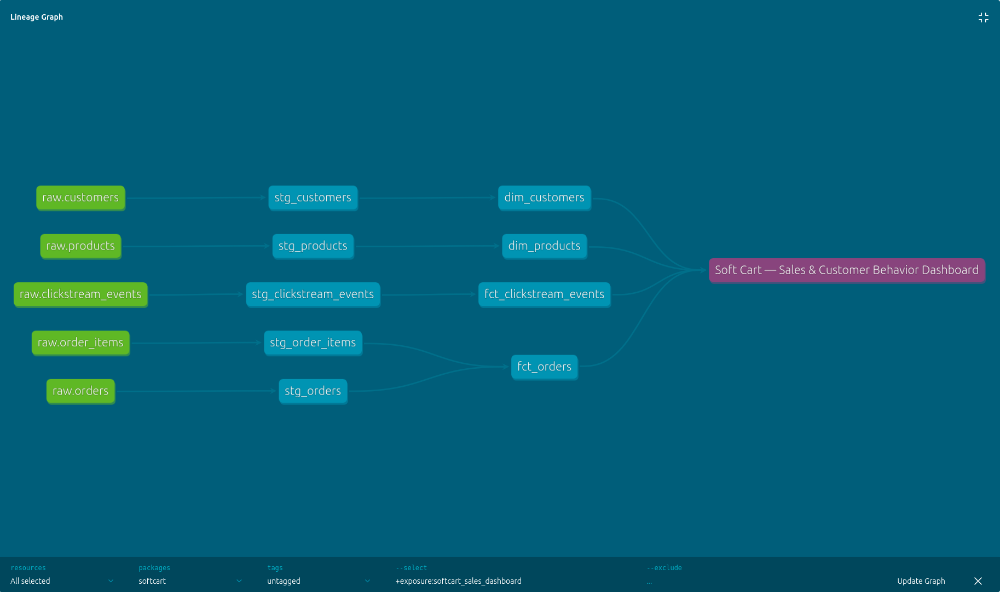

# Soft Cart — End-to-End Data Engineering Pipeline

A production-style data platform for a fictional e-commerce company, built to demonstrate how raw operational data becomes trustworthy, decision-ready analytics — end to end.

---

## The Business Problem

Soft Cart is a growing online store. Like most young e-commerce businesses, its data lives in scattered, disconnected places:

- Order and customer data sits in an operational system, with no historical record of how customers or products change over time.
- Browsing behavior (what customers look at before buying) isn't captured anywhere, so no one can answer "where do we lose customers in the funnel?"
- Product returns are tracked, if at all, without any link back to the original sale — making it impossible to see which products are quietly losing the company money.
- Nobody finds out a nightly data job failed until someone happens to check a dashboard and notices the numbers look stale.
- There's no single, trusted place for the business to ask: *"What are we selling, to whom, and what's it actually costing us in returns?"*

## What This Project Delivers

This pipeline turns that mess into a governed, tested, and automated system that answers four concrete business questions:

| Business question | How it's answered |
|---|---|
| What are we selling, and to whom? | `fct_orders`, `dim_customers`, `dim_products` — a clean star schema of every order |
| Where do customers drop off before buying? | Clickstream event tracking → conversion funnel dashboard |
| Which products are costing us money through returns? | `fct_returns_analysis` — return rate and net revenue impact per product |
| Which customers matter most, and which are at risk of churning? | RFM (Recency/Frequency/Monetary) customer segmentation |

And it does this **reliably**: data quality is enforced with automated tests, failures page the team on Slack instead of going unnoticed, and every change to a customer or product is preserved as history rather than silently overwritten.

---

## Architecture

```
Synthetic source data
        |
        v
Azure Data Lake Storage Gen2  (Bronze — raw landing zone)
        |   COPY INTO
        v
Snowflake — RAW schema        (data as received, untouched)
        |   dbt
        v
Snowflake — STAGING schema    (cleaned, contract-enforced, tested)
        |   dbt
        v
Snowflake — MARTS schema      (star schema: dimensions, facts, analysis models)
        |
        v
Power BI (via Microsoft Fabric) — dashboards
```

Orchestrated end-to-end by **Apache Airflow** (Docker), with **GitHub Actions** validating every change before it merges.

## Tech Stack

| Layer | Tool |
|---|---|
| Data lake | Azure Data Lake Storage Gen2 |
| Data warehouse | Snowflake |
| Transformation & testing | dbt (dbt-snowflake) |
| Orchestration | Apache Airflow (Docker Compose, CeleryExecutor) |
| BI / Dashboard | Power BI via Microsoft Fabric |
| CI | GitHub Actions |
| Alerting | Slack |
| Dev environment | GitHub Codespaces |

---

## Data Model

**Source system (simulated OLTP + synthetic generator):**
- `customers` — 500 rows
- `products` — 200 rows
- `orders` — order header, includes `payment_status` and `shipment_status`
- `order_items` — line items per order (grain of the core fact table)
- `clickstream_events` — simulated browsing behavior (JSON)
- `returns` — product returns, linked to real orders

**Gold-layer marts:**
- `dim_customers`, `dim_products` — with full SCD Type 2 history
- `fct_orders` — one row per order line item
- `fct_clickstream_events` — one row per browsing event
- `fct_returns_analysis` — returns aggregated per product, with return rate % and net revenue
- `fct_customer_rfm` — one row per customer, with Recency/Frequency/Monetary scores and a segment label (Champions, At Risk, Lost, etc.)

---

## Data Quality & Schema Enforcement

- All staging models have **enforced dbt contracts** — dbt refuses to build a model if its output columns/types don't match what's declared, catching schema drift before it reaches production.
- **23+ automated data tests**, covering:
  - Primary key uniqueness and not-null checks
  - Foreign key referential integrity (e.g. every return must reference a real, existing order)
  - Valid value enforcement (`accepted_values` on status fields)
  - **Custom business-logic test**: `assert_refund_not_exceeding_order_total` — fails if any refund amount exceeds its order's total, catching a real data quality bug found during development (see Known Issues Fixed below)

Run everything with: `dbt build`

### Schema routing

`dbt_project.yml` sets `+schema` at the folder level, so every model in `models/staging/` lands in `staging` and every model in `models/marts/` lands in `marts` automatically — no per-file configuration needed, and no risk of a new model silently landing in the wrong place.

```yaml
models:
  softcart:
    staging:
      +materialized: view
      +schema: staging
    marts:
      +materialized: table
      +schema: marts
```

---

## Change Tracking (SCD Snapshots)

Customer and product dimensions change over time (a customer moves cities, a product's price changes). Instead of overwriting old values, this project uses **dbt snapshots** to implement **SCD Type 2**: every change is preserved as history, with each row marked by the time range during which it was the current, valid version.

- `dim_customers_snapshot.sql` — tracks `first_name`, `last_name`, `email`, `city`, `country`
- `dim_products_snapshot.sql` — tracks `product_name`, `category`, `brand`, `unit_price`

Uses the **check** strategy (comparing column values between runs) rather than **timestamp**, since the synthetic source tables have no `updated_at` column. Verified by directly updating a test row and re-running `dbt snapshot`: the old value was correctly closed out (`dbt_valid_to` populated) and a new current row inserted.

---

## Returns Analysis

Every return is generated against a **real, existing order** (pulled live from Snowflake), with `refund_amount` mathematically capped so it can never exceed that order's total — the constraint is enforced at generation time, not just checked afterward.

`fct_returns_analysis` aggregates this into a per-product view: total returns, total refunded, net revenue after returns, and return rate %. This directly answers "which products are quietly costing us money."

## Customer Segmentation (RFM)

`fct_customer_rfm` scores every customer on three dimensions — how recently they bought, how often, and how much — and buckets them into actionable segments (Champions, Loyal Customers, At Risk, Lost, New Customers). This is the kind of analysis a real marketing team would use to decide who gets a retention campaign versus a loyalty reward.

---

## Clickstream Event Tracking

Simulated browsing behavior models a realistic customer funnel: page view → product view → add to cart → purchase, with realistic drop-off at each stage. Stored as JSON (semi-structured, since event types carry different fields), flattened in staging, and materialized incrementally in `fct_clickstream_events`.

## Idempotency

Re-running the pipeline for the same day never creates duplicate data:
- **Deterministic IDs** — derived from the DAG's logical date, not wall-clock time, so re-runs regenerate the same IDs rather than new ones.
- **Staging-layer deduplication** — `stg_orders` keeps only the latest row per `order_id` via `qualify row_number() ... = 1`, so even if `COPY INTO` loads the same data twice, duplicates never reach the marts layer.

Verified by running the DAG twice for the same day: all tests passed, and downstream models processed zero redundant rows.

## Automated Alerting

Two Slack notifications keep the team informed without anyone needing to check the Airflow UI:

- **Failure alerts** — any task failure posts the DAG, task, run date, and a direct log link to Slack, firing only after retries are exhausted.
- **Test summaries** — after every `dbt build`, a message reports how many tests passed/failed, regardless of whether the run succeeded or failed overall (`trigger_rule="all_done"`).

---

## BI Dashboard

An interactive two-page Power BI dashboard, connected via Microsoft Fabric.

**Live dashboard:** https://app.fabric.microsoft.com/links/GnSe8WPV9j?ctid=d9c25066-ba78-4b0f-8401-6b35fd17bfc9&pbi_source=linkShare




**Page 1 — Sales & Customer Behavior:** revenue KPIs, revenue trend, top products by revenue, and the customer conversion funnel.

**Page 2 — Returns & Customer Segments:** total refunded, average return rate, customer count by RFM segment, top products by return rate, and a searchable, sortable customer table — with a segment slicer that filters the customer-level visuals.

---

## Orchestration (Airflow)

The DAG `softcart_pipeline` runs daily:

1. **Generate & load** — synthetic orders, clickstream events, and returns are generated and loaded into Snowflake's `raw` schema.
2. **`run_dbt_build`** — runs `dbt build` (all models + all tests) in a dedicated dbt container, refreshing staging and marts.
3. **`slack_test_summary`** — reports the test results to Slack.

Pipeline logic is split for maintainability:
- `dags/softcart_pipeline.py` — DAG definition and task orchestration only
- `dags/softcart_utils/generators.py` — synthetic data generation
- `dags/softcart_utils/alerts.py` — Slack notifications

### Why a separate dbt container?
`dbt-snowflake` and Airflow's own Snowflake provider have conflicting dependencies that can't coexist in the same Python environment. dbt runs in its own lightweight container, and Airflow triggers it via `docker exec` over a mounted Docker socket.

## Continuous Integration

`.github/workflows/dbt-ci.yml` runs on every push/PR to `main`:
- **`dbt-compile`** — builds a profile from repo secrets and runs `dbt compile` to catch reference errors before merge.
- **`dag-validate`** — checks DAG syntax and loads it via `DagBag` (with pinned Airflow/provider versions matching production) to catch import errors.
## Data Lineage & Exposures

dbt exposures explicitly document which models feed each dashboard, so anyone can trace a Power BI visual back to its source tables — and dbt will warn before a breaking change to any model an exposure depends on.



*Auto-generated by dbt docs, showing `fct_orders`, `fct_clickstream_events`, `dim_customers`, and `dim_products` feeding the Sales & Customer Behavior dashboard.*

Full interactive lineage: https://abobakar-a.github.io/softcart-data-pipeline/#!/overview
## Performance: Clustering Keys

```sql
ALTER TABLE softcart_db.marts.fct_orders CLUSTER BY (order_date);
ALTER TABLE softcart_db.marts.fct_clickstream_events CLUSTER BY (event_timestamp);
```

Verified with `SYSTEM$CLUSTERING_INFORMATION()` — `average_depth: 1.0`, no overlaps at current table size. For larger tables, clustering on `DATE(order_date)` instead of the full timestamp would reduce re-clustering cost.

---

## Known Issues Found & Fixed

Documented here deliberately — these were real bugs caught during development, not hypothetical edge cases:

1. **Refund exceeding order total.** The returns generator initially picked a random refund amount independent of the order's value, occasionally producing a refund larger than the sale itself. Fixed by capping the random range to the order's actual total at generation time, and added `assert_refund_not_exceeding_order_total` as a permanent regression test.
2. **Schema drift.** A new model without explicit schema config silently landed in the profile's default schema instead of `marts`, and duplicate orphaned tables were found in unused schemas from an earlier configuration. Fixed at the root by setting `+schema` at the folder level in `dbt_project.yml`, and cleaned up the orphaned tables.
3. **Returns referencing incomplete orders.** Early returns sometimes referenced orders that had no line items yet (a timing mismatch between order and order-item generation), causing the returns-to-product join to silently drop rows. Fixed by only generating returns against orders that already have line items.

---

## Project Structure

    softcart-data-pipeline/
    ├── models/
    │   ├── staging/          # 1:1 cleaned models from raw sources
    │   └── marts/            # star schema + analysis models
    ├── snapshots/             # SCD Type 2 history
    ├── tests/                 # custom business-logic tests
    ├── macros/
    ├── dbt_project.yml
    ├── airflow/
    │   ├── docker-compose.yaml
    │   ├── dbt_profile/       # dbt connection profile (gitignored)
    │   └── dags/
    │       ├── softcart_pipeline.py
    │       └── softcart_utils/
    ├── .github/workflows/dbt-ci.yml
    ├── .env.example
    └── README.md

## Configuration

None of the required credentials are committed to this repo.

1. Copy `.env.example` to `.env` and fill in your values.
2. Create `airflow/dbt_profile/profiles.yml` with your Snowflake connection.
3. Set up an Airflow connection named `azure_data_lake_default`.
4. Set an Airflow Variable named `slack_webhook_url`.

## Running this locally / in a Codespace

    cd airflow
    mkdir -p dags logs plugins config
    echo -e "AIRFLOW_UID=$(id -u)" > .env
    docker compose up airflow-init
    docker compose up -d

Airflow UI: `http://localhost:8080` (default credentials: `airflow` / `airflow`)

## Known Environment Notes

- Developed in **GitHub Codespaces** after the full 7-container Airflow stack proved too resource-heavy for local Docker.
- The Airflow scheduler has occasionally shown transient instability after a full container restart in Codespaces — a targeted `docker restart airflow-airflow-scheduler-1` reliably resolves it. This is an environment resource constraint, not an application bug.

---

## Status

**Complete:**
- ADLS Gen2 + Snowflake storage integration
- dbt models, contracts, and 23+ passing data quality tests (including a custom business-logic test)
- Full Airflow DAG, tested end-to-end, with maintainable modular code
- CI via GitHub Actions
- dbt docs site, auto-deployed to GitHub Pages: https://abobakar-a.github.io/softcart-data-pipeline/
- Incremental materialization for fact tables
- SCD Type 2 change tracking for customers and products
- Clickstream event tracking with conversion funnel analysis
- Idempotent pipeline runs, verified by repeat-run testing
- Automated Slack alerting (failures + test summaries)
- Returns tracking with product-level return rate and net revenue analysis
- RFM customer segmentation
- Two-page interactive Power BI dashboard
- Snowflake clustering keys for query performance
## Cost Monitoring (FinOps)

A daily Slack alert checks Snowflake warehouse credit consumption against a threshold, using Snowflake's built-in `account_usage.warehouse_metering_history` view — the same data source Snowflake itself uses for billing.

```sql
SELECT COALESCE(SUM(credits_used), 0)
FROM snowflake.account_usage.warehouse_metering_history
WHERE warehouse_name = 'COMPUTE_WH'
  AND DATE(start_time) = CURRENT_DATE()
```

If daily credit usage exceeds the threshold (currently 2.0 credits/day, set based on observed baseline usage), a Slack alert fires — the same pattern used for pipeline failures and test summaries. This runs as the final task in the DAG (`slack_cost_alert`).
## AI Agent for Test Failure Investigation

When a dbt test fails, an AI agent (Google Gemini, via function calling) automatically investigates the failure — not just reporting it, but actively querying Snowflake to find a likely root cause — then posts a plain-English summary to Slack.

**How it works:**
1. After `dbt build`, the agent checks `run_results.json` for failed tests.
2. If any test failed, it gives Gemini a tool (`run_sql_query`) and a description of the failure, then lets the model decide what to investigate.
3. The model runs its own follow-up SQL queries against Snowflake, reads the results, and either investigates further or concludes with a summary — capped at 5 tool-call iterations to prevent runaway loops.
4. If it can't reach a confident conclusion within that limit, it says so honestly in the Slack message rather than guessing.

This is deliberately built as an **agent**, not just an LLM call: the model has tools, decides its own next steps based on real query results, and stops on its own judgment — the same investigative loop a human on-call engineer would run manually.

**Setup:**

    docker exec -it airflow-airflow-scheduler-1 airflow variables set gemini_api_key "<your Gemini API key>"

Model used: `gemini-flash-latest` (Google AI Studio free tier — 1,500 requests/day, no billing required).